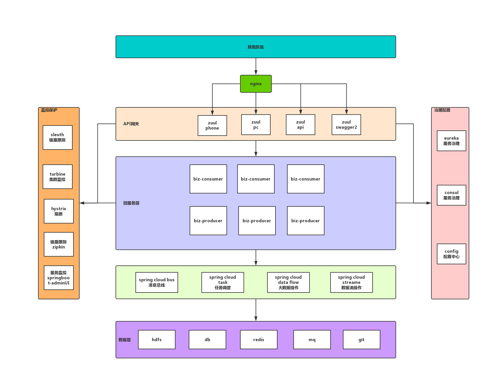

# spring-cloud
spring-cloud微服务架构

### 架构图

##### 系统架构图




### 项目结构

``` lua
spring-cloud
├── spring-cloud-config -- 配置中心（8200）
├── spring-cloud-eureka -- 注册中心（8000、8001、8002）
├── spring-cloud-zuul -- 服务网关（8888）
├── spring-cloud-producer -- 服务提供（业务实现，按模块划分，如：用户、角色、权限）（9000）
├── spring-cloud-consumer -- 服务调用（业务实现，按业务划分，如：会员,订单）（9100）
├── spring-cloud-turbine -- 熔断监控（8100）
└── spring-cloud-zipkin -- 链路跟踪（8300）

```